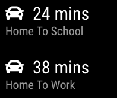
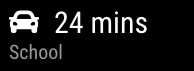
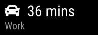

# MMM-Traffic



This a module for the [MagicMirror](https://github.com/MichMich/MagicMirror/tree/develop). It displays travel time between two locations, using the Mapbox directions API to factor in current traffic conditions.

# Table of Contents

- [Installation](#installation)
- [Mapbox Access Token](#mapbox-access-token)
- [Configuration](#configuration)
  - [Required](#required)
  - [Basic Options](#basic-options)
  - [Translation/Display](#translationdisplay)
  - [Per Day/Time Customization](#per-daytime-customization)
- [Examples](#examples)
  - [Simplest Config](#simplest-config)
  - [Minimal Look](#minimal-look)
  - [Use both lines](#use-both-lines)
  - [Multiple Routes](#multiple-routes)
  - [Per day customization](#per-day-customization)
- [Dependencies](#dependencies)
- [Legacy](#Legacy)

## Installation

Navigate into your MagicMirror's `modules` folder and execute these commands:

```shell
git clone https://github.com/SamLewis0602/MMM-Traffic.git
cd MMM-Traffic
npm install
```

## Mapbox Access Token

1. Create an account at [Mapbox](https://account.mapbox.com/)
2. Copy the access token visible after account creation (go [here](https://account.mapbox.com/) if you don't see it)
	- _Note: Google maps coordinates are `latitude,longitude`, but Mapbox uses `longitude,latitude` so be sure to reverse what you copy from Google._

## Configuration

### Required

| Option              | Description                                  | Type   | Example                   |
| ------------------- | -------------------------------------------- | ------ | ------------------------- |
| `accessToken`       | Mapbox access token                          | string | -                         |
| `originCoords`      | `longitude,latitude` of the origin location. | string | `'-84.504259,33.882107'` |
| `destinationCoords` | `longitude,latitude` of the origin location. | string | `'-84.504259,33.882107'` |

### Basic Options

| Option                  | Description                                                               | Type            | Default Value           | Supported Options   |
| ----------------------- | ------------------------------------------------------------------------- | --------------- | ----------------------- | ------------------- |
| `language`              | Define the commute time language.                                         | string          | `config.language`       | Any language string |
| `intermediateWaypoints` | A list (up to 23 elements) of intermediate points to be visited in order. | array of string | `undefined`             |                     |
| `interval`              | How often the traffic is updated in milliseconds.                         | integer         | `300000`<br>(5 minutes) |                     |
| `showSymbol`            | Whether to show the car symbol or not.                                    | boolean         | true                    |                     |

### Translation/Display

Use these options to customize/translate the module's text.

_\*Note: See tokens below to see what tokens will be replaced with real values
in firstLine/secondLine._

| Option        | Description                                                                         | Type   | Default Value                           | Token Replacement  |
| ------------- | ----------------------------------------------------------------------------------- | ------ | --------------------------------------- | ------------------ |
| `loadingText` | The text used when loading the initial duration.                                    | string | `'Loading...'`                          | :x:                |
| `firstLine`   | The main line of the module                                                         | string | `'Current duration is {duration} mins'` | :heavy_check_mark: |
| `secondLine`  | The second line of the module, appears below the first line in smaller, dimmer text | string | `undefined`                             | :heavy_check_mark: |

#### Tokens

| Token        | Value                                         |
| ------------ | --------------------------------------------- |
| `{duration}` | The driving time returned from the mapbox API |

### Per Day/Time Customization

Using these options to hide the module when you're not using it will save API calls,
allowing you to have a shorter interval or more MMM-Traffic modules without getting
rate limited.

| Option       | Description                                                              | Type       | Default                 |
| ------------ | ------------------------------------------------------------------------ | ---------- | ----------------------- |
| `days`       | Which days of the week to show the traffic module, with 0 being Monday   | Array[int] | `[0, 1, 2, 3, 4, 5, 6]` |
| `hoursStart` | What time to begin showing the module on the days it shows, 24 hour time | String | `"00:00"`                 |
| `hoursEnd`   | What time to stop showing the module on the days it shows, 24 hour time  | String | `"23:59"`                 |

## Examples

### Simplest Config

```js
{
	module: "MMM-Traffic",
	position: "top_left",
	config: {
		accessToken: "your_key_here",
		originCoords: "-84.398848,33.755165",
		destinationCoords: "-84.504259,33.88210",
	}
},
```


### Minimal Look

```js
{
	module: "MMM-Traffic",
	position: "top_left",
	config: {
		accessToken: "your_key_here",
		originCoords: "-84.398848,33.755165",
		destinationCoords: "-84.504259,33.88210",
		showSymbol: false,
		firstLine: "{duration} mins"
	}
},
```


### Use both lines

```js
{
	module: "MMM-Traffic",
	position: "top_left",
	config: {
		accessToken: "your_key_here",
		originCoords: "-84.398848,33.755165",
		destinationCoords: "-84.504259,33.88210",
		firstLine: "{duration} mins",
		secondLine: "Coffee Run"
	}
},
```


### Multiple Routes

```js
{
	module: "MMM-Traffic",
	position: "top_left",
	config: {
		accessToken: "your_key_here",
		originCoords: "-84.398848,33.755165",
		destinationCoords: "-84.504259,33.88210",
		firstLine: "{duration} mins",
		secondLine: "Home To School",
	}
},
{
	module: "MMM-Traffic",
	position: "top_left",
	config: {
		accessToken: "your_key_here",
		originCoords: "-84.398848,33.755165",
		destinationCoords: "-84.504259,33.88210",
		firstLine: "{duration} mins",
		secondLine: "Home To Work"
	}
},
```


### Route passing by fixed points.

You may have multiple usual paths to reach the same destination. A simple way to calculate
time is to insert a point to be visited. You can insert up to 23 intermediate waypoints.

```js
{
        module: "MMM-Traffic",
        position: "top_left",
        config: {
                accessToken: "your_key_here",
                originCoords: "-84.398848,33.755165",
                intermediateWaypoints: ["-84.504259,33.80100"],
                destinationCoords: "-84.504259,33.88210",
                firstLine: "{duration} mins",
                secondLine: "Work via highway",
        }
},
{
        module: "MMM-Traffic",
        position: "top_left",
        config: {
                accessToken: "your_key_here",
                originCoords: "-84.398848,33.755165",
                intermediateWaypoints: ["-84.504259,33.84150"],
                destinationCoords: "-84.504259,33.88210",
                firstLine: "{duration} mins",
                secondLine: "Work via city",
        }
},
```

### Per day customization

This setup would show one route for Monday, Wednesday, and Friday, and another for
Tuesday and Thursday. It would only show between 07:00 and 09:00 each day. It would
be completely hidden on weekends.

```js
{
	module: "MMM-Traffic",
	position: "top_left",
	config: {
		accessToken: "your_key_here",
		originCoords: "-84.398848,33.755165",
		destinationCoords: "-84.504259,33.88210",
		firstLine: "{duration} mins",
		secondLine: "School",
		days: [0,2,4],
		hoursStart: "07:00",
		hoursEnd: "09:00"
	}
},
{
	module: "MMM-Traffic",
	position: "top_left",
	config: {
		accessToken: "your_key_here",
		originCoords: "-84.398848,33.755165",
		destinationCoords: "-84.504259,33.88210",
		firstLine: "{duration} mins",
		secondLine: "Work",
		days: [1,3],
		hoursStart: "07:00",
		hoursEnd: "09:00"
	}
},
```

| Day         | View                                           |
| ----------- | ---------------------------------------------- |
| Mon/Wed/Fri |   |
| Tu/Th       |  |

## Dependencies

- [node-fetch](https://www.npmjs.com/package/node-fetch)
- [moment](https://www.npmjs.com/package/moment)

## Legacy

If you want to continue using the old version with Google Maps and more customization, use the [1.0-not-supported](https://github.com/SamLewis0602/MMM-Traffic/tree/1.0-not-supported) branch.

<b>NOTE</b>: this version is no longer supported, please do not open issues on the repo if you run into issues with this version.
